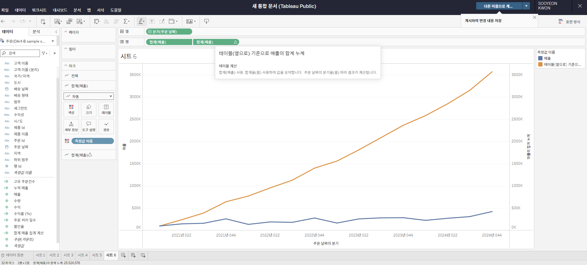

# Fourth Study Week

- 30강: [계층](#30-계층)

- 31강: [집합](#31-집합)

- 32강: [결합집합](#32-결합집합)

- 33강: [계산된 필드](#33-계산된-필드)

- 34강: [행수준계산](#34-행수준계산)

- 35강: [집계계산](#35-집계계산)

- 36강: [테이블계산](#36-테이블계산)

- 37강: [퀵테이블계산(1)](#37-퀵테이블계산1)

- 38강: [퀵테이블계산(2)](#38-퀵테이블계산2)

- [문제1](#문제-1)

- [문제2](#문제-2)

- [문제3](#문제-3)

## Study Schedule

| 강의 범위     | 강의 이수 여부 | 링크                                                                                                        |
|--------------|---------|-----------------------------------------------------------------------------------------------------------|
| 1~9강        |  ✅      | [링크](https://www.youtube.com/watch?v=AXkaUrJs-Ko&list=PL87tgIIryGsa5vdz6MsaOEF8PK-YqK3fz&index=84)       |
| 10~19강      | ✅      | [링크](https://www.youtube.com/watch?v=AXkaUrJs-Ko&list=PL87tgIIryGsa5vdz6MsaOEF8PK-YqK3fz&index=75)       |
| 20~29강      | ✅      | [링크](https://www.youtube.com/watch?v=AXkaUrJs-Ko&list=PL87tgIIryGsa5vdz6MsaOEF8PK-YqK3fz&index=65)       |
| 30~38강      | ✅      | [링크](https://youtu.be/e6J0Ljd6h44?si=nhGbB7GsdOCqj15f)       |
| 39~49강      | 🍽️      | [링크](https://www.youtube.com/watch?v=AXkaUrJs-Ko&list=PL87tgIIryGsa5vdz6MsaOEF8PK-YqK3fz&index=45)       |
| 50~59강      | 🍽️      | [링크](https://www.youtube.com/watch?v=AXkaUrJs-Ko&list=PL87tgIIryGsa5vdz6MsaOEF8PK-YqK3fz&index=35)       |
| 60~69강      | 🍽️      | [링크](https://www.youtube.com/watch?v=AXkaUrJs-Ko&list=PL87tgIIryGsa5vdz6MsaOEF8PK-YqK3fz&index=25)       |
| 70~79강      | 🍽️      | [링크](https://www.youtube.com/watch?v=AXkaUrJs-Ko&list=PL87tgIIryGsa5vdz6MsaOEF8PK-YqK3fz&index=15)       |
| 80~89강      | 🍽️      | [링크](https://www.youtube.com/watch?v=AXkaUrJs-Ko&list=PL87tgIIryGsa5vdz6MsaOEF8PK-YqK3fz&index=5)        |

<!-- 여기까진 그대로 둬 주세요-->

> **🧞‍♀️ 오늘의 스터디는 지니와 함께합니다.**


## 30. 계층

<!-- 계층 구조와 관련된 개념, 사용 방법 등을 적어주세요. -->
- 뷰에서 데이터를 "Drill Down"해 값을 세부적으로 찾을 때 유용한 방법
<br/>

- 행 선반에 "매출" 필드를 올리고 왼쪽 +를 선택하면 연도별로 나타났던 데이터가 자동으로 분기별, 월별, 일별 매출 데이터 생성됨
    => Tableau에서 날짜 데이터와 함께 제공되는 경우, 자동으로 계층을 생성함
- 자동으로 계층 생성되지 않은 경우, **계층 생성법**
    - 테이블창에서 테이블1을 테이블2에 드래그 -> 계층 만들기창 -> 계층명 입력 -> 완성~
    - 생성한 계층에 다른 테이블도 넣고 싶으면 드래그해오면 됨
    - 드래그로 계층 내 순서 바꾸기 가능
<br/>

- **계층별 매출 보기**
    1. 생성한 계층 필드를 행으로 드래그
    2. '매출' 필드를 계층 필드에 드래그
    3. 왼쪽 + 눌러가며 계층별로 매출 보기


## 31. 집합

<!-- 집합의 정의 및 활용 방법에 대해 알게 된 점을 적어주세요. -->
- 사용자가 직접 어떤 조건을 설정하고 그 조건을 기반으로 데이터들을 구분하는 방법

- **집합 만들기** (수익 상위 10개 도시)
    1. [테이블] 우클릭 -> '만들기' -> '집합'
    2. [집합 만들기 창]
        - 일반탭 : 그룹 기능과 비슷하게 수동으로 데이터 선택해 묶기 가능
        - 조건탭 : 사용자가 설정한 조건이 충족되면 데이터 묶기
        - 상위탭 : 상위 or 하위 순서로 데이터 묶기
        우리는 수익 상위 10개 도시만 표현할 것이므로, 상위탭 -> 필드 기준에서 상위 선택 -> 수익 선택된 것 확인
    3. [마크창] 생성된 집합 필드를 색상 위로 드래그 -> 상위 10개 도시와 not 도시가 색상으로 구분됨


## 32. 결합집합

<!-- 결합집합의 개념 및 사용 사례를 적어주세요. -->
- 집합은 기본적으로 한 가지 조건 적용.<br/>
    두 가지 조건을 적용하고 싶다면? 결합된 집합 사용!

- **결합집합 만들기** (매출이 5만원 이상, 수익률 10% 이상 도시 데이터 구분)
    - 1번째 집합 만들기
    1. [필드창] 시/도 필드 우클릭 -> 만들기 -> 집합
    2. [조건탭] 매출 필드 선택 -> ">(이상)" 선택 -> "50,000" 입력 
    3. [마크창] 생성된 집합 필드를 색상 위로 드래그
    <br/>

    - 2번째 집합 만들기
    1. [필드창] 시/도 필드 우클릭 -> 만들기 -> 집합
    2. [조건탭] 수익률 필드 선택 ->  ">(이상)" 선택 -> "0.1" 입력 
    3. [마크창] '수익률'을 텍스트로, 새로 생성된 집합 필드를 색상 위로 드래그
    <br/>

    - 집합 결합하기
    1. 1번째 필드를 우클릭 -> '결합된 집합 만들기' -> [창] 1,2번째 필드 선택
    2. 결합 4가지 옵션 중 
        - 두 집합의 공유 멤버 : 집합1 and 집합2에 해당하는 멤버 표시
        선택
    3. 완성~
 
## 33. 계산된 필드

<!-- 계산된 필드를 사용하는 방법과 예시를 적어주세요. -->
- 데이터 원본에 있는 필드를 활용해 new 필드를 만드는 기능<br/>
    기존 데이터 이외에 계산해야 할 데이터가 추가로 필요한 경우

- **계산된 필드 만들기 3가지 방법**
    1. 데이터 패널을 통해 생성
    2. 분석 탭을 활용해 생성
    3. 사용하고자 하는 필드 위에 우클릭

    - 계산 필드 내에 문자 값을 입력할 경우에는 '' (작은따옴표) 안에 입력해야함!!
    - 주석 작성 시 // 입력 후 작성


    - Tableau의 2가지 계산 방식
        1. 행 수준 계산
        2. 집계 계산


## 34. 행수준계산

<!-- 행수준 계산의 의미와 적용 방법을 적어주세요. -->
- 기본 계산
    - 데이터 원본에 대한 행 수준 계산 OR 집계 계산
    - 기본 계산의 2가지 방식
        * **행 수준 계산: 데이터의 각 레코드를 통해 계산하는 방식**
        * 집계 계산 : 현재 뷰에서 보여지는 기준으로 계산하는 방식

    - 행 수준 계산에서 발생할 수 있는 오류
    
    - 어떤 주문 ID들이 여러 개의 제품 레코드를 가지고 있어서 계산된 필드에서 일수를 전부 합계해버리기 때문에 실제로는 '4일'이여야 하는데 '12일'로 나타남. 이 문제를 해결하려면 **해당 필드를 측정값에서 차원 값으로 변경해야함!!** 
        - 아래 사진처럼 필드창에서 해당 필드를 우클릭하고, 차원값으로 변경하면 됨
    
    

<br/>
기본계산 이외에 테이블 계산, LOD 표현식이 있음

## 35. 집계계산

<!-- 집계계산의 정의 및 활용 사례에 대해 알게 된 점을 적어주세요. -->
- 집계 계산 : 현재 뷰에서 보여지는 기준으로 계산하는 방식

- 뷰에서 필드 레벨에 따라 해당 레벨에 관련된 레코드를 통해 계산해서 원한 값을 반환해 데이터를 확인
    - 모든 측정값은 뷰로 드래그했을 때 자동으로 SUM 함수로 필드를 보여주지만, 이 계산 방식을 변경할 수 있음! 
        - [필드창] 원하는 필드 우클릭 -> '기본 속성'에서 '집계' 선택 


## 36. 테이블계산

<!-- 테이블 계산의 개념 및 사용 방법을 적어주세요. -->
- 테이블계산 : 뷰에 보이는 내용을 바탕으로 계산

- 계산 방향 바꾸는 방법
    1. 해당 필드에 우클릭 -> '다음을 사용하여 계산' -> 원하는 계산 방향 선택
    2. 테이블 계산된 필드에 우클릭 -> '테이블 계산 편집' 선택 -> 계산 방향 선택 (여기서는 원하는 정렬 방식 선택도 가능)


## 37. 퀵테이블계산(1)

<!-- 퀵테이블 계산의 원리 및 예제에 대해 알게 된 점을 적어주세요. -->
- 퀵테이블계산 : 테이블 계산에서 가장 자주 쓰이는 테이블 계산 유형들을 클릭만으로 가능하게 만든 기능

- 사용 방법
    - 사용하고자 하는 필드 위 우클릭 -> '퀵테이블계산' -> 계산 유형 선택
    - 계산 유형
        1. 누계 : 집계한 값을 누적한 값으로 한번 더 집계해주는 계산 유형
        
        2. 차이 : 측정값이 기준 값과 어느 정도 차이가 나는지 구하는 계산 유형
        3. 비율 차이 : 측정값들 사이의 성장률 또는 % 차이를 표현 (ex. 월별 수익 차이를 %로 보고 싶을 때)
        
        4. 구성비율 : 전체에서 각 항목들의 비중을 확인할 때 사용 (ex. 지역별로 제품 매출 비중이 어떤지 알고 싶을 때)
        5. 백분위수 : 전체에서 각 멤버들의 백분위를 표시 (ex. 매출이 많은 고객과 적은 고객을 보고자 할 때)

## 38. 퀵테이블계산(2)

<!-- 이동평균, YTD 총계, 전년 대비 성장률, YTD 성장률 등 본 강의에서 알게 된 점을 적어주세요. -->
- 이동 평균 : 이전의 값부터 현재까지 값에 대한 평균을 낼 때 사용 (주식에서 많이 사용)


- YTD (Year to Date) : 특정 시점을 기준으로 해당 연도부터 그 시점까지의 총계
    - 기본적으로 누계와 같은 개념이지만, '연도'보다 하위레벨 필드인 '분기' 또는 '월'이 있어야 사용 가능


- 통합 성장률 (Compound Growth Rate)

- 전년 대비 성장률 : 같은 월을 기준으로 이전 연도 대비 얼마 정도 성장했는지 살펴보는 데에 활용

- YTD 성장률


## 문제 1.

규석이는 이제껏 매출을 올리는 데에 힘썼었지만, 왠지 모르게 주머니에 들어오는 돈이 없어 속상합니다. 

그래서 매출이 상위 20곳에 속하지만, 수익률(%)이 마이너스인 시/도를 확인하려고 합니다.

> 수익률은 SUM([수익]) / SUM([매출])로 정의합니다.

어떤 집합을 만들었고, 어떤 결합을 하였는지를 중심으로 기술하고, 결과 자료를 첨부해주세요. 

(텍스트 표 형태이며, 색상으로 위 집합을 구분할 수 있게 만들어주세요.)

<!-- 아래 예시 이미지를 삭제하고, 직접 만든 시트 사진을 올려주세요. 시트의 이름은 본인 이름으로 기입해주세요-->
```
집합 만들기창이 안 뜨는 이슈로,, 일단 사진 없이 풀이만 제출합니다,,ㅠㅠ

풀이
1. 매출이 상위 20곳인 시/도 집합 생성 
    - 집합 만들기창에서 상위탭 -> 필드 기준에서 '상위', '20' 선택

2. 계산된 필드 생성 -> 수익률 필드(SUM([수익]) / SUM([매출])) 생성

3. 수익률(%) 마이너스인 시/도 집합 생성 
    - 집합 만들기창에서 조건탭 -> 필드 기준에서 수익률(%) 선택-> '<', '0' 선택

4. 매출이 상위 20곳이면서, 동시에 수익률(%)이 마이너스인 시/도 결합 집합 생성
    - 1번째 필드 우클릭 -> '결합된 집합 만들기' -> 1,2번째 필드 선택 후 '두 집합의 공유 멤버'
```


## 문제 2.
선희는 주문 Id별로 주문에서 배송까지에 걸리는 날짜 일수가 궁금했습니다. 
그래서 주문 ID별로 주문에서 배송까지 걸리는 일자를 '배송까지 걸린 일수'라는 계산된 필드로 만들고, 이를 마크에 올린 후 확인해보았습니다. 
이때, 계산된 필드의 식은 'DATEDIFF' 함수를 이용하였습니다.

배송까지 걸린 일수 계산을 위한 DATEDIFF 함수 수식을 적어주세요.

```
DATEDIFF('day', [주문날짜], [배송날짜])
```


그런데 위 그림처럼 '주문 날짜'와 '배송 날짜'를 함께 행에 올려 확인해보니, 주문날짜와 배송날짜의 차이가 '배송까지 걸린 일수'와 다릅니다.

ID-2021-11126을 보니, 11월 26일 배송에 11월 30일 배송이면 4일 차이인데, 12일이 걸렸다고 하네요. 왜 이런 문제가 생긴걸까요?

```
'배송까지 걸린 일수'가 측정값(합계)로 설정되어 있어서 발생한 문제다. 

어떤 주문 ID들이 여러 개의 제품 레코드를 가지고 있어서 계산된 필드에서 일수를 전부 합계해버리기 때문에 실제로는 '4일'이여야 하는데 '12일'로 나타남.
```

그리고 이를 해결하기 위해서는 어떻게 해야 할까요?

```
해당 필드를 측정값에서 차원 값으로 변경해야함.
필드창에서 해당 필드를 우클릭하고, 차원값으로 변경하면 됨.
```


## 문제 3.

다음은 Tableau의 다양한 계산을 사용할 수 있는 경우를 빈칸으로 두고 문제를 작성한 것입니다. 각 빈칸에 적합한 계산 유형을 채워보세요.

보기
> **누계, 차이, 비율 차이, 구성 비율, 순위, 백분위수, 이동 평균, YTD 총계, 통합 성장률, 전년 대비 성장률, YTD 성장률**

| 계산 유형               | 설명                                                                 | 사용 예시                                                                                          |
|-------------------------|----------------------------------------------------------------------|-----------------------------------------------------------------------------------------------------|
| 누계           | 데이터의 누적 합계를 계산                                             | 한 기업이 월별 매출 데이터를 누적하여 연간 매출 추이를 보고 싶을 때 사용                                      |
| 차이            | 연속 데이터 포인트 간의 차이를 계산                                    | 한 기업이 월별 매출 데이터에서 전월 대비 매출 증감량을 분석하고 싶은 경우                                        |
| 비율 차이            | 연속 데이터 포인트 간의 비율 변화를 계산                               | 한 기업이 월별 매출 데이터에서 전월 대비 매출 증감률(%)을 분석하고 싶은 경우                                      |
| 구성 비율            | 전체에서 각 데이터 포인트의 비율을 계산                                | 한 기업이 전체 매출에서 각 제품군이 차지하는 비율을 보고 싶을 때 사용                                           |
| 순위            | 데이터의 순위를 매깁니다                                              | 한 기업이 제품별 매출 데이터를 순위별로 정렬하여 상위 10개 제품을 분석하고 싶은 경우                              |
| 백분위수            | 데이터의 백분위를 계산                                               | 한 기업이 고객별 구매 금액 데이터를 백분위수로 나누어 상위 25% 고객을 분석하고 싶은 경우                          |
| 이동평균            | 일정 기간의 평균을 계산                                               | 한 기업이 주간 매출 데이터에서 4주 이동 평균을 계산하여 트렌드를 분석하고 싶은 경우                              |
| YTD 총계            | 연초부터 현재까지의 총계를 계산                                      | 한 기업이 월별 매출 데이터를 연초부터 현재까지 누적하여 연간 매출 목표 달성 여부를 분석하고 싶은 경우             |
| 통합 성장률            | 일정 기간 동안의 연평균 성장률을 계산                                  | 한 기업이 5년 간 매출 데이터를 바탕으로 연평균 성장률(CAGR)을 계산하고 싶은 경우                                  |
| 전년 대비 성장률            | 전년 동기간 대비 성장률을 계산                                        | 한 기업이 월별 매출 데이터에서 전년 동월 대비 매출 성장률을 분석하고 싶은 경우                                    |
| YTD 성장률            | 연초부터 현재까지의 성장률을 계산                                     | 한 기업이 올해 연초부터 현재까지의 매출이 전년 동기 대비 얼마나 성장했는지 분석하고 싶은 경우                     |

> 사용 예시를 참고하여 실제 경우처럼 생각하며 고민해보아요!
