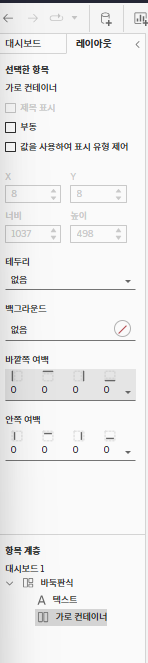
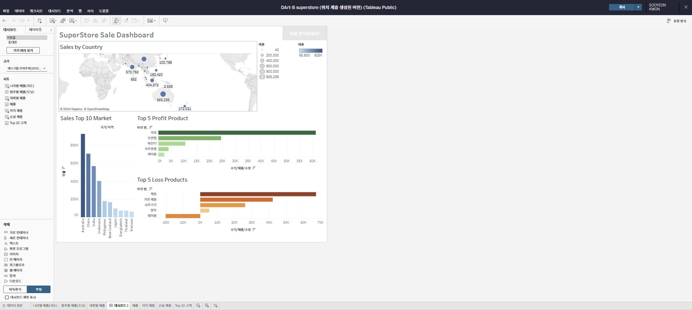
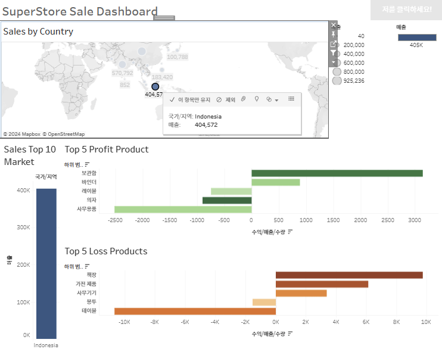
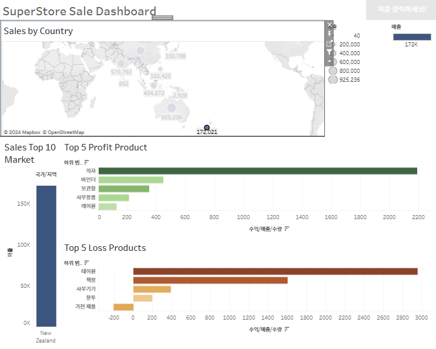

# Sixth Study Week


## Study Schedule
<br>

| 회차 | 강의 범위   | 강의 이수 여부 | 링크                                                                                                     |
|------|-------------|----------------|--------------------------------------------------------------------------------------------------------|
| 1    | 1~7강       | ✅              | [링크](https://www.youtube.com/watch?v=AXkaUrJs-Ko&list=PL87tgIIryGsa5vdz6MsaOEF8PK-YqK3fz&index=84)    |
| 2    | 8~17강      | ✅              | [링크](https://www.youtube.com/watch?v=AXkaUrJs-Ko&list=PL87tgIIryGsa5vdz6MsaOEF8PK-YqK3fz&index=75)    |
| 3    | 18~27강     | ✅              | [링크](https://www.youtube.com/watch?v=AXkaUrJs-Ko&list=PL87tgIIryGsa5vdz6MsaOEF8PK-YqK3fz&index=65)    |
| 4    | 28~37강     | ✅              | [링크](https://www.youtube.com/watch?v=e6J0Ljd6h44&list=PL87tgIIryGsa5vdz6MsaOEF8PK-YqK3fz&index=55)    |
| 5    | 38~47강     | ✅              | [링크](https://www.youtube.com/watch?v=AXkaUrJs-Ko&list=PL87tgIIryGsa5vdz6MsaOEF8PK-YqK3fz&index=45)    |
| 6    | 48~57강     | ✅              | [링크](https://www.youtube.com/watch?v=AXkaUrJs-Ko&list=PL87tgIIryGsa5vdz6MsaOEF8PK-YqK3fz&index=35)    |
| 7    | 58~67강     | 🍽️             | [링크](https://www.youtube.com/watch?v=AXkaUrJs-Ko&list=PL87tgIIryGsa5vdz6MsaOEF8PK-YqK3fz&index=25)    |
| 8    | 68~77강     | 🍽️             | [링크](https://www.youtube.com/watch?v=AXkaUrJs-Ko&list=PL87tgIIryGsa5vdz6MsaOEF8PK-YqK3fz&index=15)    |
| 9    | 78~85강     | 🍽️             | [링크](https://www.youtube.com/watch?v=AXkaUrJs-Ko&list=PL87tgIIryGsa5vdz6MsaOEF8PK-YqK3fz&index=5)     |
---

<br/>
<!-- 여기까진 그대로 둬 주세요-->

> **🧞‍♀️ 오늘은 강의보다 실습과 대시보드 직접 만들기가 더 중요하니, 기록보다는 사고하며 강의를 들어주세요.**

## 48. 워크시트 서식(2)

<!-- 워크시트에 관해 본 강의에서 알게 된 점을 적어주세요 -->
```
- 테두리 : '서식' 탭 -> '테두리' 선택 (퍼블릭에서는 못 찾았음ㅠㅠ)
    - 색상, 굵기 등 설정 가능

- 라인 : '서식' 탭 -> '라인' 선택
    - 뷰에서 표시된 데이터의 축에 대한 라인 모양을 설정 가능
    - 추세선과 참조선을 추가하면 각 라인들의 서식을 여기서 별도로 설정 가능
```


## 49강. 대시보드패널

<!-- 대시보드패널 강의에서 알게 된 점을 적어주세요. -->


## 50. 대시보드 구성방식

<!-- 알게 된 점을 적고, 아래 질문에 답해보세요 :) -->

> **🧞‍♀️ 부동과 바둑판식 방식을 차이를 중점으로 기술해보세요**
```
- 바둑판식 : 격자무늬 구조에 따라 개체를 구성 (특정 위치에만 위치 가능)
- 부동 : 개체를 자유롭게 배치할 수 있으며, 사용자가 원하는대로 개체를 drag&drop해서 배치 가능
    - 개체를 움직이더라도 다른 개체의 크기나 모양에는 영향 
    - 대시보드 크기가 자주 변경되지 않는 경우 / 대시보드에 빈 공간 많은 경우에 사용하는 것이 좋음
```


## 51. 대시보드 컨테이너

개체 배치 전에 컨테이너를 먼저 배치할 수 있음
- 컨테이너 : 대시보드 개체들과 워크시트들을 그룹화하고 구성할 수 있는 공간
    - 가로 컨테이너 : 내부 개체들을 '수평' 공간에 배열할 때
    - 세로 컨테이너 :     "       '수직'      "


대시보드는 행이 쌓이는 구조 (1행: 제목, 2행: 큰 값 배너, 3행: 맵과 그래프) 
- 1행을 위해 '개체'에서 '가로 컨테이너'를 드래그함
    - 잘 들어갔는지는 '레이아웃' 탭에서 아래 사진과 같이 확인해볼 수 있음

<br/>


## 52. 레이아웃 패널
대시보드의 개체 속성을 변경
- 제목 표시 o/x
- 부동 개체로 변경
    - 부동 옵션 선택을 해제한다 = 해당 개체가 이전의 위치로 돌아가지 않는다는 것
- 개체의 위치와 크기를 픽셀 단위로 변경
- 테두리 변경 
- 컨테이너 배경(백그라운드) 색상 변경


## 53. 필터 동작

<!-- 필터 동작에 대해 알게 된 점을 적어주세요 -->
- 필터 동작 방법
1. 차트 클릭 -> 드롭다운 메뉴에서 필터 옵션 선택
2. 대시보드 탭 -> 동작 클릭 -> 전체 통합 문서에 있는 동작 확인 가능 -> '이 시트' 옵션 선택해 이 시트에 존재하는 동작 확인 -> 동작 추가 클릭해 필터 동작 만들기
    - 원본 시트
    - 대상 시트 : 동작 실행 시 변경할 워크시트


## 54. 대시보드 하이라이터 동작

<!-- 하이라이터에 대해 알게 된 점을 적어주세요 -->
- 전체 데이터 중 원하는 데이터를 다른 데이터들과 비교할 수 있도록 하이라이트로 구분하는 기능
- 대시보드 탭 -> 동작 클릭 -> 동작 만드는 탭에서 동작 추가 선택 -> 원본 시트와 대상 시트 구분해 설정
- [주의] 선택 기준으로 사용하는 필드가 변경할 그래프에 포함되어 있어야 하이라이트 작동함!! (적어도 마크창의 텍스트에라도 넣어둬야 함)


## 55. 대시보드 URL

<!-- URL에 대해 알게 된 점을 적어주세요 -->
- 대시보드 탭 -> 동작 클릭 -> 동작 추가에 'URL로 이동' 선택 -> 원본 시트와 동작 실행 조건 선택 -> [주의] URL에 특정 부분에만 넣고 싶은 URL을 넣으면 어떤 부분에서든 다 이 URL이 삽입되므로 '삽입'에 '국가/지역' 선택


## 56. 대시보드 시트에 이동 동작

<!-- 대시보드 시트에 이동에 대해 알게 된 점을 적어주세요!-->
- 대시보드 공간만으로는 모든 데이터를 표현하기 어려울 때가 있음 (많이 넣는만큼 각 데이터의 크기가 작아지니 보기도 어려워짐) 
=> 대시보드의 특정 차트에서 특정 부분을 클릭했을 때 도구 설명에 링크 클릭하면 원하는 차트로 이동할 수 있게 도와주는 동작


- 대시보드 탭 -> 동작 클릭 -> 동작 추가 항목에서 '시트로 이동 동작 추가' 선택 -> 대상 시트 선택

- 이동 동작한 시트에서 기존 대시보드로 이동하기 번거로움
=> 상단에 '탐색 개체' 배치 -> 개체 옵션에서 '편집 단추' 선택 -> '이동할 위치'에 기존 대시보드 선택 -> 이렇게 만들어진 단추 아래에 라인 만들기 -> alt키 누른 상태에서 단추 클릭시 기존 대시보드로 이동! 


## 57. 매개변수 변경 동작

<!-- 매개변수 변경 동작에 대해 알게 된 점을 적어주세요!-->
- 매개변수를 필터와 연결해 사용
- 대시보드 탭 -> '동작' 선택 -> 동작 추가에서 '매개 변수 변경' 클릭 -> 원본 시트, 대상 매개 변수, 원본 필드 선택 
- 이렇게 매개변수 변경하면 대시보드의 모든 그래프에서 매개 변수로 설정한 범위에 대한 데이터로 변경됨!


## 문제

오늘은 별도의 문제가 없습니다. 


여러 대시보드를 참고하시어, superstore 데이터를 사용해 나만의 대시보드를 제작해주세요.

**단, 워크시트 3개 이상의 그래프를 표시해야 하며 각 시트 간 상호작용성 필터 or 하이라이트 동작은 꼭 추가되어야 합니다**

<br/>

<br/>

<br/>
```
상호작용성 필터로 'Sales by Country'에서 국가를 선택했을 때 해당 국가의 매출, top 5 profit product, top 5 loss product이 나오도록 설정함 
```

어떤 부분에 가중을 두었는지, 어떤 사용자 편의성을 고려하였는지에 대한 설명이 필요합니다.
```
첨부된 대시보드를 참고해서 '매출'과 관련된 대시보드

- 목적 : 여러 국가에 지사가 많은 기업이라는 전제를 두고 매달 국가별 매출과 매출이 높은 하위범주 top 5, 매출이 낮은 하위범주 top 5 등 실적을 비교하고자 함


- 고려 사항
    -  대시보드를 본격적으로 만들기 전 활용할 시트의 모양을 고려했을 때 어떤 구조로 대시보드를 만들 것인지
        - 국가별로 매출을 비교하는 것이므로 국가별 매출(지도) 시트를 가장 위에
        - 매출 top 10 국가 시트를 그 아래에
        - 매출 top 10 국가 시트 옆에 하위범주 top 5(매출 높은/매출 낮은) 두 개를 쌓아서 한눈에 비교되도록 함

- 새롭게 알게 된 점
    - 시트 넣기 전에 컨테이너(용기)를 내가 계획한 구조에 맞춰서 잘 넣기
    - 컨테이너 활용 시 하나의 가로 컨테이너 안에 있는 시트 요소들을 균등한 크기로 맞추기(균등 분할 기능) 쉬움
    - 빈페이지 활용법! 
        - 가로 컨테이너, 세로 컨테이너, 가로 컨테이너를 연속으로 배치한 이후 그 안에 시각화 시트를 넣고자 하는 경우에 어느 컨테이너에 배치되는지 확인 불가능. 
        - 이런 경우를 대비해서 컨테이너 안에 빈페이지 2개를 넣어주면 좋음. 
        - 시트를 제외한 빈페이지/컨테이너는 모두 투명하므로 빈페이지를 배치하고 빈페이지에 임의의 색상을 부여해서 구분하면 편함!


- 아쉬운 점
    - 카드 만드는 법 .. 아직도 모르겠다 더 찾아보기ㅠ
    - 대시보드가 단조로워서 아쉬움. 도전했다가 실패한 KPI 대시보드.. 재구매율, 수익률 등 넣어서 다음 시간에 다시 도전해보기
```
